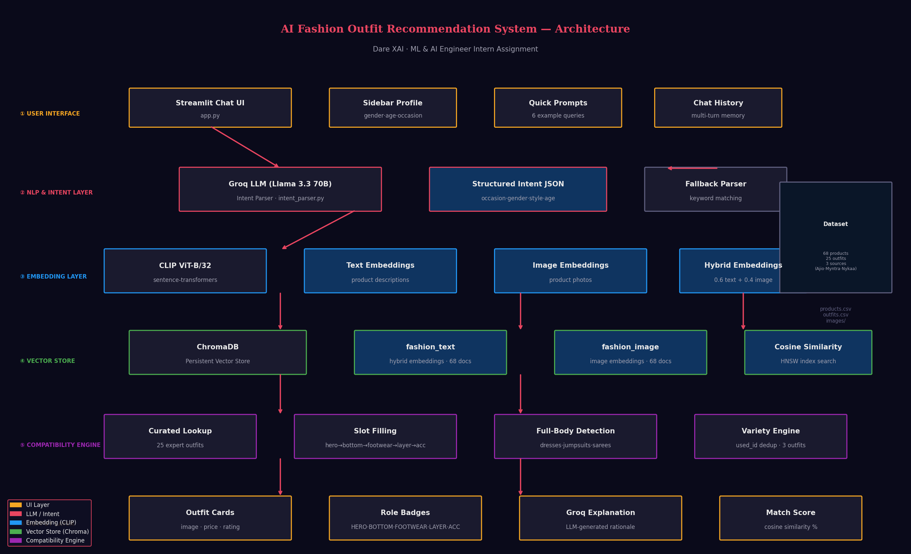

# 👗 AI Fashion Outfit Recommendation System

---

## 🎯 Overview

A multimodal AI-powered fashion assistant that understands natural language requests and recommends complete, styled outfits with explainable reasoning.

**Example interactions:**
- *"I need a formal outfit for a job interview, I am a 25 year old male"*
- *"Suggest a stylish party outfit for a 22 year old woman"*
- *"Beach vacation look for a girl who loves boho style"*

---

## 🏗️ Architecture



### System Flow

```
User Message
    │
    ▼
Groq LLM (Llama 3.3 70B)          ← Parses intent: occasion, gender, style, age
    │
    ▼
CLIP ViT-B/32 Embedder             ← Encodes query into 512-dim vector
    │
    ▼
ChromaDB Vector Store              ← Cosine similarity search across 68 products
    │
    ▼
Compatibility Engine               ← Slot filling: hero→bottom→footwear→layer→accessory
    │
    ▼
Groq LLM (Explainer)               ← Generates personalized outfit rationale
    │
    ▼
Streamlit UI                       ← Displays outfit cards with images + explanation
```

---

## 🛠️ Tech Stack

| Component | Technology | Purpose |
|-----------|------------|---------|
| Embeddings | CLIP ViT-B/32 (sentence-transformers) | Image + text → 512-dim vectors |
| Vector DB | ChromaDB (persistent, local) | Fast cosine similarity search |
| LLM | Groq API · Llama 3.3 70B | Intent parsing + outfit explanation |
| UI | Streamlit | Conversational chat interface |
| Compatibility | Curated lookup + slot filling | Outfit assembly engine |
| Dataset | 68 products · 25 expert outfits | Ajio · Myntra · Nykaa |

---

## 📁 Project Structure

```
fashion-assistant/
├── app.py                    # Streamlit chat UI
├── ingest.py                 # One-time embedding + ChromaDB ingestion
├── config.py                 # Paths, models, category maps, theme
├── engines/
│   ├── embedder.py           # CLIP dual-encoder (text + image + hybrid)
│   ├── vector_store.py       # ChromaDB wrapper (search + ingest)
│   ├── compatibility.py      # Outfit assembly + curated lookup
│   ├── intent_parser.py      # Groq intent parsing + explanation
│   └── recommender.py        # End-to-end pipeline
├── utils/
│   ├── data_loader.py        # CSV loading, image loading, product lookup
│   └── image_utils.py        # Collage generation, image utilities
├── architecture/
│   ├── generate_diagram.py   # Architecture diagram generator
│   └── architecture_diagram.png
├── data/
│   ├── products.csv          # 68 product metadata records
│   ├── outfits.csv           # 25 expert-curated outfit combinations
│   └── images/               # Product images (ajio/ myntra/ nykaa/)
├── chroma_db/                # Persisted vector embeddings (auto-generated)
├── assets/
│   └── style.css             # UI theme and styling
├── requirements.txt
└── .env                      # GROQ_API_KEY (not committed)
```

---

## 🚀 Setup & Run

### 1. Clone the repository
```bash
git clone https://github.com/YOUR_USERNAME/fashion-assistant.git
cd fashion-assistant
```

### 2. Create environment
```bash
conda create -n fashion-ai python=3.11 -y
conda activate fashion-ai
pip install -r requirements.txt
```

### 3. Configure API key
```bash
echo GROQ_API_KEY=your_key_here > .env
```
Get your free Groq API key at: https://console.groq.com

### 4. Add dataset
Place the dataset files in `data/`:
```
data/
├── products.csv
├── outfits.csv
└── images/
    ├── ajio/
    ├── myntra/
    └── nykaa/
```

### 5. Run ingestion (one-time)
```bash
python ingest.py
```
Embeds all 68 products using CLIP and stores them in ChromaDB (~30 seconds).

### 6. Launch the app
```bash
streamlit run app.py
```

---

## 🧠 ML Approach

### Multimodal Embeddings
Each product is encoded using CLIP ViT-B/32 into a shared 512-dimensional space:

- **Text embedding**: product name + brand + category + occasion + description + tags
- **Image embedding**: product photo processed by CLIP vision encoder
- **Hybrid embedding**: `0.6 × text + 0.4 × image` (text-weighted for better retrieval)

### Outfit Compatibility Engine
Two-stage retrieval:

1. **Curated lookup**: Matches against 25 expert-styled outfits using gender + occasion scoring
2. **Slot filling**: Vector similarity search fills outfit slots in priority order:
   ```
   hero → bottom → footwear → layer → accessory
   ```
   Full-body items (dresses, sarees, kurta-sets) automatically skip the bottom slot.

### Explainability
Every recommendation includes a Groq LLM-generated explanation that:
- Names each specific item
- Explains color and style compatibility
- References the user's occasion and profile
- Provides stylist-level reasoning

---

## 📊 Dataset

| Metric | Value |
|--------|-------|
| Total Products | 68 |
| Expert Curated Outfits | 25 |
| Women's Items | 41 |
| Men's Items | 27 |
| Occasions | casual, party, office, festive, wedding, beach |
| Sources | Ajio, Myntra, Nykaa |
| Price Range | ₹270 – ₹7,799 |
| Embedding Dimensions | 512 (CLIP ViT-B/32) |

---

## ✨ Features

- 💬 **Conversational Interface** — Natural language fashion requests
- 👤 **User-Aware** — Adapts to gender, age, occasion, style preference
- 🖼️ **Multimodal** — Uses both product images and text metadata
- 🎯 **Explainable** — Every outfit comes with AI-generated styling rationale
- 👗 **Complete Outfits** — Hero + Bottom + Footwear + Layer + Accessory
- 📦 **25 Curated Looks** — Expert-styled outfits as ground truth
- ⚡ **Fast** — Sub-3 second recommendations via Groq + ChromaDB
